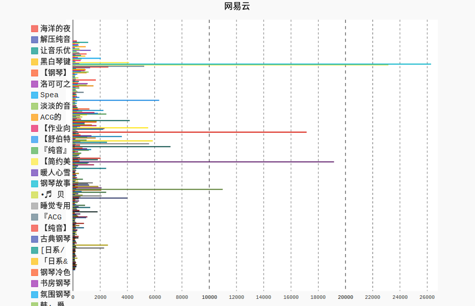
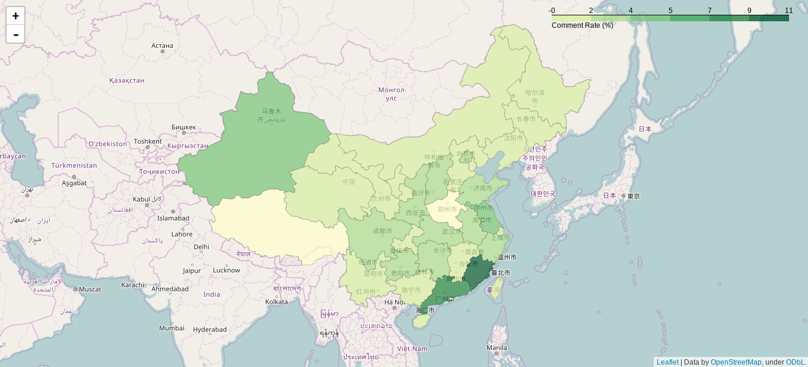
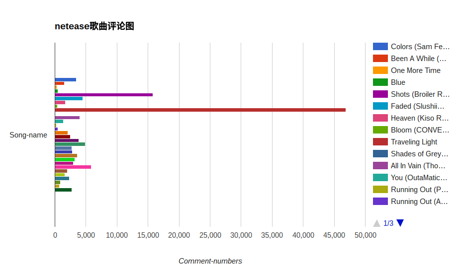

# neteasefloat
**07-01更新**

增加爬取专辑和歌手热门歌曲，修改云图支持中文

**06-14更新**

爬取歌单播放量

**06-04更新**

地图炮完成 。。。。。。。。。。。。。。。。。

**06-03更新**

增加了一个爬用户的脚本，以后弄一个地图分析用户分布

**05-21更新**

不在通过第三方包创建图表，改成修改html文件。链接：（等会）  

**05-13更新**

多线程已经完成，比以前快了4倍，并优化各个文件的代码

**05-07更新**

将数据添加到数据库，方便js网页的制图。%( ⊙ o ⊙ )%

**03-21更新**  
加入词云脚本，效果对比：：    
！[cloud](data_file/some.jpg) 
**03-20更新说明了**  
需要用到的第三方库  
@：  
**uniout** 说明：可以直接打印list中的中文  
**gpcharts** 说明：将数据用js图表展示  
**Crypto** 说明: 一个python加密工具包，网易云对音乐的评论进行了加密处理，需要用到ASE。  
**其他base64,hashlib,requests不一一说明**  
**03-19更新截图了**

