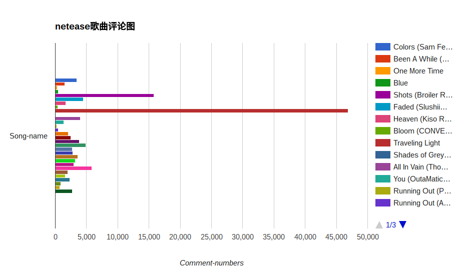

# neteasefloat

**更新说明了**
需要用到的第三方库
@：
**uniout** 说明：可以直接打印list中的中文
**gpcharts** 说明：将数据用web版js图表展示
**Crypto** 说明: 一个python加密工具包，网易云对音乐的评论进行了加密处理，需要用到ASE。
**其他base64,hashlib,requests不一一说明**
**更新截图了**

